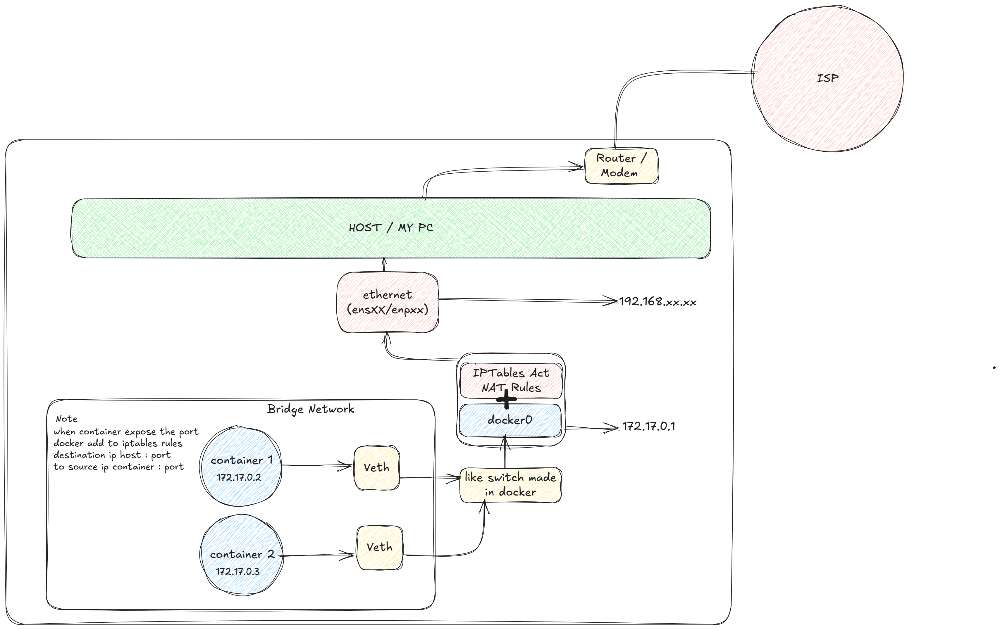

# 📦 Docker Network Fundamentals

This repository contains practical examples of basic **Docker Networking** using different **network drivers**: `bridge`, `custom bridge`, `host`, and `none`.

Each network type is explained with an **illustration** and a **docker-compose.yml** file to help you understand easily.

---

## 📂 Project Structure

```
├── bridge
│   ├── bridge-network.png
│   └── docker-compose.yml
├── custom-bridge
│   ├── custom-bridge-network.png
│   └── docker-compose.yml
├── host
│   ├── docker-compose.yml
│   └── host-networks.png
├── none
└── README.md
```

---

## 📚 Docker Network Driver Explanations

---

### 1. 🛤️ Bridge Network (Default)

The `bridge` network is Docker's default network driver.  
When a container is started without specifying a network, it automatically connects to the default bridge.

**Characteristics:**
- Each container gets a **private IP address**.
- Containers can communicate via **container name**.
- Internet access is enabled through **NAT (Network Address Translation)**.

📷 Illustration:  


🛠️ Example:
```bash
docker network ls
docker-compose -f bridge/docker-compose.yml up -d
```

---

### 2. 🛠️ Custom Bridge Network

Custom bridge networks offer more control compared to the default bridge network.

**Characteristics:**
- **Better DNS-based service discovery** (containers can resolve each other’s names easily).
- Ability to configure **custom subnets, gateways**, and even assign **static IP addresses**.

📷 Illustration:  


🛠️ Example:
```bash
docker-compose -f custom-bridge/docker-compose.yml up -d
```

---

### 3. 🖥️ Host Network

With the `host` network driver:
- Containers **share the host's networking stack** directly.
- No network isolation between container and host.
- Port mappings (`ports:`) are **ignored**.
- **Better performance** due to no virtualization overhead.

**Drawback:**  
Risk of **port conflicts** between the host and containers.

📷 Illustration:  


🛠️ Example:
```bash
docker-compose -f host/docker-compose.yml up -d
```

---

### 4. 🚫 None Network

The `none` network driver disables all networking for a container.

**Characteristics:**
- The container has **no network interface** except the loopback device.
- Useful for **isolated jobs** that do not require any networking.

🛠️ Example:
```bash
docker compose -f none/docker-compose.yml up -d 
# No internet access
```

---

## 🎯 Learning Goals

- Understand different **Docker network drivers**.
- Practice setting up **docker-compose** files with various networking modes.
- Learn the differences between **Bridge**, **Custom Bridge**, **Host**, and **None** modes.
- Interpret **network diagrams** related to container communications.

---

## 🚀 Future Learning (Optional)

After mastering these fundamentals, you can explore:
- **Macvlan** networks (directly connect containers to physical network).
- **Overlay** networks (for Docker Swarm and multi-host communication).

---

## 🙌 Credits

This repository is built for **educational purposes** and personal experimentation with Docker networking fundamentals.  
All network diagrams included are created specifically for this learning project.
