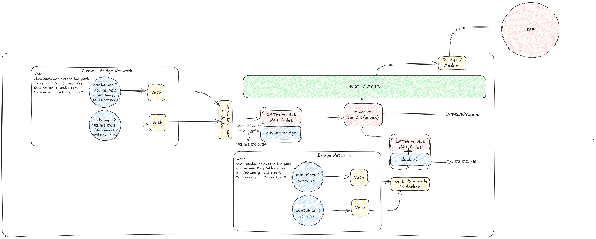
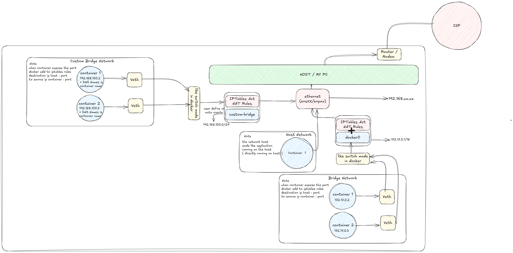
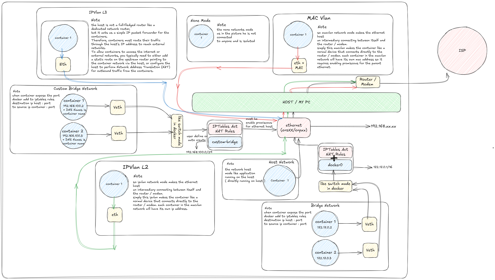

# 📦 Docker Network Fundamentals

This repository contains practical examples of basic **Docker Networking** using different **network drivers**: `bridge`, `custom bridge`, `host`, and `none`.

Each network type is explained with an **illustration** and a **docker-compose.yml** file to help you understand easily.

---

## 📂 Project Structure

```
├── bridge
│   ├── bridge-network.png
│   └── docker-compose.yml
├── custom-bridge
│   ├── custom-bridge-network.png
│   └── docker-compose.yml
├── host
│   ├── docker-compose.yml
│   └── host-networks.png
├── none
└── README.md
```

---

## 📚 Docker Network Driver Explanations

---

### 1. 🛤️ Bridge Network (Default)

The `bridge` network is Docker's default network driver.  
When a container is started without specifying a network, it automatically connects to the default bridge.

**Characteristics:**
- Each container gets a **private IP address**.
- Containers can communicate via **container name**.
- Internet access is enabled through **NAT (Network Address Translation)**.

📷 Illustration:  


🛠️ Example:
```bash
docker network ls
docker-compose -f bridge/docker-compose.yml up -d
```

---

### 2. 🛠️ Custom Bridge Network

Custom bridge networks offer more control compared to the default bridge network.

**Characteristics:**
- **Better DNS-based service discovery** (containers can resolve each other’s names easily).
- Ability to configure **custom subnets, gateways**, and even assign **static IP addresses**.

📷 Illustration:  


🛠️ Example:
```bash
docker-compose -f custom-bridge/docker-compose.yml up -d
```

---

### 3. 🖥️ Host Network

With the `host` network driver:
- Containers **share the host's networking stack** directly.
- No network isolation between container and host.
- Port mappings (`ports:`) are **ignored**.
- **Better performance** due to no virtualization overhead.

**Drawback:**  
Risk of **port conflicts** between the host and containers.

📷 Illustration:  


🛠️ Example:
```bash
docker-compose -f host/docker-compose.yml up -d
```

---

### 4. 🐧 Macvlan Network

The `macvlan` network driver assigns a **unique MAC address** to each container, making it appear as a **physical device** on the network.

**Characteristics:**
- Containers are directly accessible from the external network, **just like real physical devices**.
- Each container gets its **own IP address** from the physical network.
- **No NAT**; containers can talk directly to other devices on the LAN.
- Requires configuration of the **parent interface** to enable promiscous.

📷 Illustration:  


🛠️ Example:
```bash
docker-compose -f macvlan/docker-compose.yml up -d
```

---

### 5. 🌐 IPvlan L2 (Layer 2 Mode)

The `ipvlan` L2 mode behaves similar to `macvlan`, but instead of each container having a unique MAC address, **all containers share the same MAC address** (the host’s MAC).

**Characteristics:**
- Containers communicate over the physical network at Layer 2 (Ethernet).
- Containers are assigned individual **IP addresses** from the LAN network.
- **No MAC flooding** like in `macvlan`, making it more scalable for large networks.

📷 Illustration:  


🛠️ Example:
```bash
docker-compose -f ipvlan.L2/docker-compose.yml up -d
```

---

### 6. 🛰️ IPvlan L3 (Layer 3 Mode)

In IPvlan L3 mode, containers communicate **via IP routing** rather than Layer 2 bridging.

**Characteristics:**
- Containers are assigned IP addresses from a **different subnet**.
- Containers must route their traffic **through the host** (which acts like a basic router).
- Ideal for isolating container networks and controlling routing more explicitly.
- Static routes or NAT on the host are often needed for internet access.

📷 Illustration:  


🛠️ Example:
```bash
docker-compose -f ipvlan.L3/docker-compose.yml up -d
```

---

### 7. 🚫 None Network 
The `none` network driver **completely disables networking** for a container.

**Characteristics:**
- The container has **only the loopback interface** (`lo`).
- Useful for highly secure and isolated workloads.
- **No external network communication** possible unless manually configured.

📷 Illustration:  


🛠️ Example:
```bash
docker-compose -f none/docker-compose.yml up -d
```

---

## 🎯 Updated Learning Goals

- Understand advanced network drivers like **Macvlan** and **IPvlan**.
- Practice setting up Docker networks that connect containers **directly to physical networks** or **through routing**.
- Recognize when to use **Layer 2** vs **Layer 3** container networking.
- Visualize container communication using **network diagrams**.

---

## 🚀 Future Learning (Optional)

After mastering these fundamentals, you can explore:
- **Overlay** networks (for Docker Swarm and multi-host communication).

---

## 🙌 Credits

This repository is built for **educational purposes** and personal experimentation with Docker networking fundamentals.  
All network diagrams included are created specifically for this learning project.
